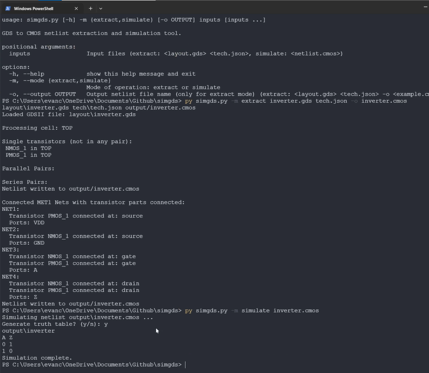

## Hi there 👋

### About Me 📖

Hey! I'm `Evan`, I am a highschool sophomore (as of January 2026).
I'm currently dedicated to concepts in computer engineering, and semiconductor physics
and devices.

### Education 🎓
✅ **Courses I have taken thus far**:
  - `AP Computer Science A` (2024-2025)
  - `Discrete Structures` (Fall 2025)

⏳ **Ongoing**:
  - `MOOCs` related to VLSI, and CMOS fabrication.
  - `Data Structures` (Spring 2026)
    
📆 **Upcoming**:
  - None
### Notable repo(s) 💻
- [**SimGDS**](https://github.com/evanliu-at-icstudents/simgds) -
  _Recreation of a core part of the LVS verification process_

  

### Contact Info 💬
✉️ [personal.evanliu@gmail.com](mailto:personal.evanliu@gmail.com)

### My top 3
🥇 [@scriptwriter101](https://github.com/scriptwriter101)  
🥈 [@jaynouMa](https://github.com/jaynouMa)  
🥉 [@tikkikkit21](https://github.com/tikkikkit21)
